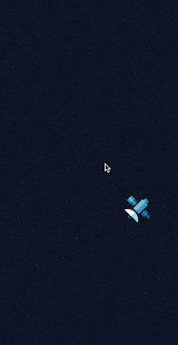

# react-spring Parallax

A react-spring parallax effect built with React, Typescript and Vite

## Live Demo

- [https://emanuelefavero.github.io/react-spring-parallax/](https://emanuelefavero.github.io/react-spring-parallax/)



## Installation

- Clone the repo and `cd` into it, then run:

```bash
npm install
```

## Usage

```bash
npm run dev
```

## Resources

- [react-spring](https://www.react-spring.io/)
- [Vite](https://vitejs.dev/)
- [Typescript](https://www.typescriptlang.org/)

## License

- [MIT](LICENSE.md)
